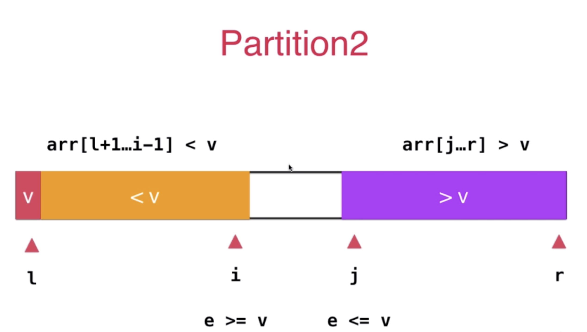
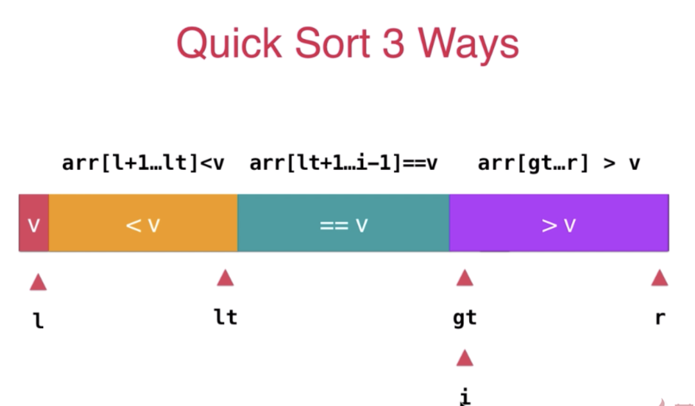

# 一起来学习数据结构与算法吧

## 一些常用经典算法和数据结构的回顾

### 首先是最经典的排序问题

- 排序

  - 选择排序(Selection Sort)复杂度 O(n^2)

    > 找到最小的元素然后与当前位置交换
    > 

  - 插入排序(Insertion Sort)复杂度 O(n^2)

    > 找到合适的位置然后插入
    > 

  - 改进的插入排序(取消了交换操作)

    > 将当前位置的元素先拿出 然后逐个与之前的元素比较 如果小于 就将之前的元素后移 在与前一位比较
    > 

  - 冒泡排序(Bubble Sort)

  - 希尔排序(Shell Sort)

  - 归并排序(Merge Sort)复杂度 O(n\*logn)

    > 先不断的二分
    > 
    > 归并过程
    > 

  - 归并排序自底向上版(Merge Sort Buttom Up)

    > 不先对数组进行二分 直接以 1、2、4 这样大小循环合并直至数组全部合并完成

  - 快速排序(Quick Sort)

    > 先选中一个元素 然后找到它应该所在的位置 然后继续递归
    > 

    - 第一部分 partition
      > 先选中一个元素 然后找到它应该所在的位置 然后继续递归
      > 
      > 如果此时 e > v，那么 e 直接加入到紫色的数组中  
      > 如果此时 e < v, 那么直接将 e 与 j 所指向的位置交换即可 之后 j++
      > 
      > 最后所有元素分类完毕之后 将 l 与 j 所在位置的元素交换一下即可
      > 

  - 快速排序存在的两点问题

    1. 对于近乎有序的数组,快速排序会退化到复杂度 O(n^2),此时解决办法就是随机选取一个初始值 然后与第一个需要定位的元素 l 交换 这样操作 快速排序的期望复杂度 EO(Nlogn)
    2. 对于一个  数量庞大但是所有元素都在一个很小区间的数组,快速  排序依旧会退化到复杂度 O(n^2),因为会导致大量的不平衡数组出现
       > 

  - 此时 使用双路快排(hard):scream:

    > 主要在 partition 过程中进行了更加细化的操作
    > 

  - 三路快排
    - 这是初始排序的情况  
    > 
    - 此时是排序完毕的情况
    > 

- 堆(优先队列)
  - 二叉堆
  > 堆 是一个完全二叉树
  > 

- 排序算法总结
  > 
  
- 最大索引堆
  - 基础 添加index用来记录当前索引堆每个元素所在的位置
  > 
  - 优化 添加reverse行用来存储索引对应index中的数
  > 
  - reverse数组more detail
  > 
  - 二项堆
  - 斐波那契堆
